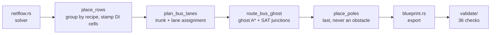
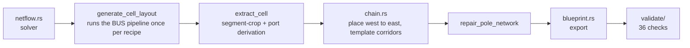

# Cell vs Bus Architecture

**Reference** (per the docs taxonomy: evergreen how-things-work; keep current
when the subject changes). Written 2026-08-01; numbers cite the RFC/status
entries current at that date.

Two different ways the layout engine turns a solved recipe graph into tile
placements — what each one physically builds, which code paths run for each,
and which one wins where, by measurement rather than preference.

## The short answer

Spaghettio ships **two** ways to turn a recipe graph into a Factorio
blueprint. The **bus** (`crates/core/src/bus/layout.rs`) is the default and
the only architecture that runs a single, global routing problem: every
machine row taps into one of a small number of shared belt trunks, and a
negotiated-congestion router works out every tap at once. **Cell
composition** (`crates/core/src/bus/cells/`) is the alternative: it runs the
bus engine once per recipe to produce a small self-contained block — a
*cell* — then chains those blocks directly together, machine output to
machine input, with no shared trunk at all. Measured across a dozen RFCs,
the bus wins at low and moderate rate and stays the unconditional default;
cell composition is the only path that reaches configurations the bus
refuses to build, and is the sanctioned direction for scaling to high
throughput.

## Anatomy

### Bus (default)

```text
[row]   [row]   [row]   [row]     ← machine rows, grouped by recipe
  │       │       │       │       ← tap-offs, planned by the router
══╧═══════╧═══════╧═══════╧═════  ← shared trunk lanes
```

Machines group by recipe into **rows**. Trunk lanes run the length of the
factory on parallel columns. A row taps into its trunk through a tap-off the
router plans; the whole set of taps is solved together — negotiated-
congestion A\* plus a region-growth junction solver, with a SAT solver
called in for hard crossings.

- One row template family per recipe shape (single-input, dual-input,
  sideload bridges).
- Poles are placed *last*, after routing — never a routing obstacle.
- Every tier of the recipe complexity ladder (1–7) lays out clean on this
  path.

Pipeline: `place_rows → plan_bus_lanes → route_bus_ghost → place_poles`.

### Cell composition (candidate)

```text
┌────┐    ┌────┐    ┌────┐    ┌────┐
│cell│───▶│cell│───▶│cell│───▶│cell│   ← self-contained blocks, chained
└────┘K×  └────┘    └────┘    └────┘K×    (K× = ratio copies side by side)
```

Each recipe becomes its own tiny factory — the bus engine run once, then
**cropped** to its port boundary. Cells are placed west→east and joined by a
small fixed set of template corridors, not a shared trunk: straight run,
corner, underground hop, 2→1 merge splitter, 1→2 fan-out splitter.

- Ratio mismatches are absorbed by stamping **K** identical copies side by
  side at 1/K rate, not by widening a shared lane.
- Fluid subgraphs (mega-cells) skip the crop entirely — cropping sheds
  inter-row fluid trunks, so a fluid cell keeps its whole engine layout
  uncropped.
- Enabled by default since RFC-051, but competes as a candidate and only
  wins where it actually wins.

Modules: `bus/cells/{extract, chain, compose, mega, placement, registry}.rs`.

### Two different things share the word "cell"

Cell *composition* above is a separate pipeline. **Direct-insertion (DI)
cells** (`bus/di_cell.rs`, RFC-053) are something else entirely: a
bus-native optimization that fuses *two adjacent rows* of an ordinary bus
layout — one tile apart, coupled by inserters, with no belt for that one
item between them. A stack inserter moves 12.0/s machine-to-machine at zero
research, against the 4.8/s ceiling a belt-to-belt long-handed bridge is
stuck with. It still lives entirely inside `place_rows` and the ordinary
trunk/lane pipeline; it just removes one interface. DI competes as
`DirectInsertion::Candidate` and has been on by default since 2026-07-26 —
measured across 20 targets, 15 bit-identical, 5 flipped, **zero regressed**,
every flip strictly denser (e.g. 2684 → 1904 entities on
`space-platform-foundation@1`). Its own reference cell measures 11 tiles
tall against a 17-tile bus baseline for the same coupling. Coverage stays
structurally narrow, though: a machine has two neighbours, so a
producer:consumer ratio outside roughly 2× can't form a cell at all — 7 of
10 probed real targets build none.

## Pipeline — shared code, separate code

Both architectures sit downstream of the **same** solver and upstream of the
**same** export and validation — neither knows which path produced the
`LayoutResult` it's handed.





The interesting fact isn't that the two pipelines differ — it's that the
composition pipeline's first real step *is* the bus pipeline, called
recursively, once per recipe, to generate each cell. Composition doesn't
replace the bus engine; it uses the bus engine as a factory for small,
disposable factories, then wires the outputs together with a fixed corridor
kit instead of asking the global router to solve the whole thing at once.
That's also where composition's ceiling comes from: the corridor kit is
small and template-based (no negotiated A\*, no junction solver), so it can
only connect shapes the templates cover — straight runs, corners, one
underground hop, one merge, one fan-out.

Export (`blueprint.rs`) and validation (`validate/`, 36 checks) are
identical either way — they consume a plain `LayoutResult` + `SolverResult`
and have no branch for which architecture built it.

## Trade-offs, measured

| Dimension | Bus | Cell composition |
|---|---|---|
| Default status | On, unconditionally | Candidate since RFC-051 — competes, ships only where it wins |
| Where each wins | Everything the ladder covers — tiers 1–7, low/mid rate | Configs the bus *hard-refuses*: EC@15/s, EC@30/s, EC@60/s (#336), mil5-from-ore |
| Density when both build | Wins by construction | 1.5–3× more entities for the same job |
| Scaling to high rate | Bounded by belt tier + one shared trunk's lane-splitting machinery | K-quantized side-by-side copies — add copies, don't widen a lane |
| Routing mechanism | One global negotiated-congestion solve across the whole factory | No global solve — fixed template-corridor kit |
| Sim-measured throughput | Mostly at-plan; tracked residuals (e.g. 8 inserter-throughput warnings, production-science pack) | Mixed — see below |

### Why the rate ceiling differs

A bus factory has exactly one set of trunk lanes; pushing more items through
them means widening lanes or adding merge-tap machinery to one shared spine
(the `(n,1)` merge-tap fallback for over-capacity sideloads is still a
parked issue). A composed chain sidesteps that by ratio-quantizing: if a
stage's flow would overload one corridor, the composer stamps **K** whole
parallel copies of the chain at 1/K rate each, so no corridor ever exceeds
express-belt capacity. That's the mechanical reason "scale up" and "cell
composition" point the same direction in this project.

### Sim-measured results, by fixture

- **PASS at plan** — `chem-pack@5` (exact 5.00/5.00, 172/172 machines),
  `AC-from-plates` (−0.3%), `mil5-from-plates` (exact 5.00/s, first
  physical validation of its westward bypasses).
- **FAIL, unresolved** — `PU@4` at −27.3% (its original inserter-count
  attribution was disproven; the deficit is real but not yet attributed)
  and `USP@2` at −57.3% (settled across three re-measurements, converged
  over 9 flat windows, unregistered — tracked as #453).

The composed path's own close-out is blunt about why it can't win on the
generic soft score even when it's correct: *"composed density is always
1.5–3× worse so it loses by construction, whereas DI is typically denser
and would win even where it regresses warnings."* Composition only ever
surfaces in the search where the bus has no candidate to lose to.

## Status & direction

- **Bus** — default for every solve. The recipe complexity ladder is SOLVED
  clean through tier 7 (utility-science-pack, a deep multi-fluid chain) on
  this path alone. This is where new recipe coverage lands first.
- **DI cells** — default as a bus-internal candidate. Structurally bounded
  by producer:consumer ratio, not by eligibility — Phase 3 (multi-band
  cells) is the only lever that would widen it, and remains open.
- **Cell composition** — candidate, partly experimental. It is the only
  path that clears some hard bus refusals, but two of its four largest
  sim-verified fixtures still miss plan, one by an unattributed margin.

> "Bus stays low-rate winner; high rates via composition."
> — project strategy review, 2026-07

The most recent multi-target work (**RFC-062**, closed **Partial**
2026-08-01) ran that question to a measured verdict from the other side:
rather than composing cells, it tried fusing two products (electronic +
advanced circuits) onto one shared bus, and its final gate compared the
result head-to-head against simply placing two independent factories side
by side. The LP-level probe had suggested "just build it twice" wastes ~10%
of machines on duplicated upstream — but in the physical build that saving
evaporated entirely (integer machine-count rounding: 139 = 57 + 82, an
exact tie), while the shared bus paid +6.8% entities and +32% bounding-box
area for its own routing machinery. The RFC's shipped recommendation is
naive concatenation — i.e. *composition beat the shared bus on its home
turf*, the strongest evidence yet for the strategy quote above. The
multi-target *solver* landed and stays (the naive shortcut is provably
wrong without it); only the merged-bus layout lost. The meeting point
between bus and cells remains *"the future cell-interface RFC"* —
anticipated, not yet written.

One more thread worth naming honestly: RFC-064's aspect-ratio/belt-transit
objective cleared its owner-calibration gate on 2026-08-01 (Kendall
τ_b = 0.64, exact agreement on the #1 layout) using *folding* as its best
example — a 17.3:1 ribbon folded to a 1.09:1 square, Factorio-verified at
plan. That result was born on the cell-composition / mega-chain path
(`chain-mil5ore`) — but Phase 1's corpus-applicability spike (run later the
same day) overturned the assumption that it stays there: the fold search
runs cleanly on ordinary row-bus layouts too, and found 2 of its 3
admissible folds on them (best: a 2.48:1 stress fixture to 1.22:1 for
+6.7% entities). Notably, the refusal mode that blocks the mega-chains
(`InputStranded`) never fired on a single row-bus fixture — bus layouts
feed inputs from the trunk edge, structurally avoiding it. Overall
admissibility still landed under the pre-registered 25% auto-selection bar,
so folding ships as an explicit opt-in knob (`fold=1`) rather than an
automatic candidate.

## Reference index

| Area | Where |
|---|---|
| Bus engine | `bus/layout.rs`, `bus/placer.rs`, `bus/lane_planner.rs`, `bus/ghost_router.rs` |
| DI cells | `bus/di_cell.rs` — RFC-053 |
| Cell composition | `bus/cells/*` — RFC-048 / RFC-051 / RFC-052; `tests/cell_composition.rs` |
| Direction / open work | RFC-062 (multi-target outputs), RFC-064 (spaghetti objective: folding, transit) |
| Status ledger | [`status.md`](status.md) — recipe complexity ladder, RFC close-out index (narratives in `archive/`), residual warnings |
